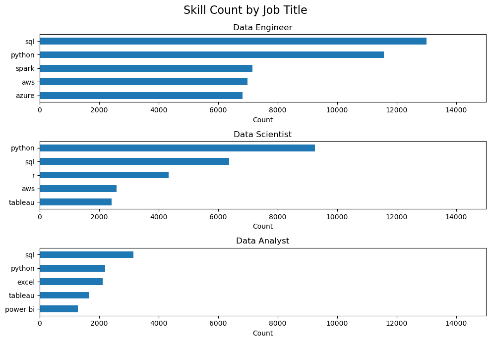
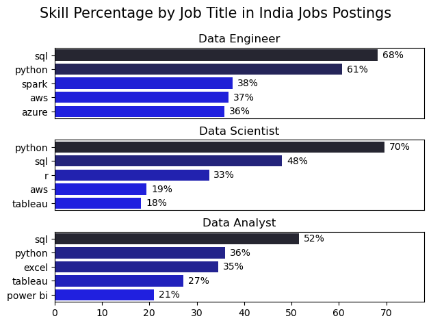
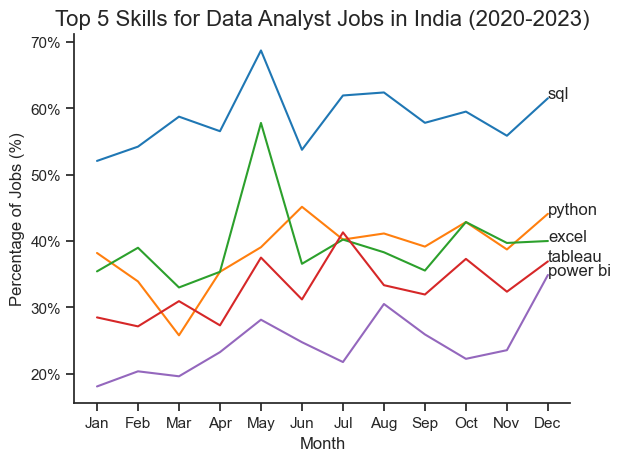
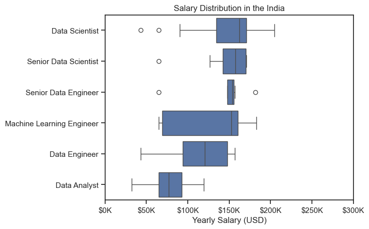
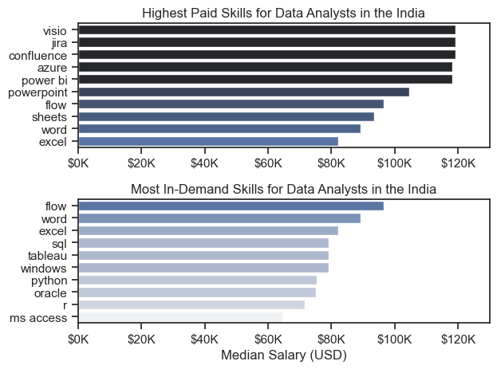
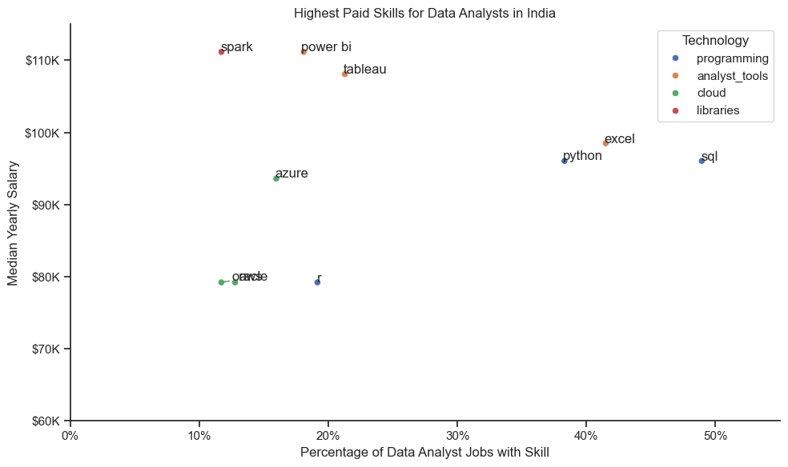

# Data Jobs Analysis — Skill Demand & Pay

## Overview
This project digs into the [`lukebarousse/data_jobs`](https://huggingface.co/datasets/lukebarousse/data_jobs) dataset — a large sample of job postings for data roles, including posting date, location, salary, and the list of skills mentioned in each listing.

The goal is to move past "learn SQL and Python" generic advice and actually check it against the data, specifically for someone targeting a **Data Analyst** career: which skills the top roles ask for, whether Data Analyst skill demand is stable or shifting month to month, how DA pay compares to other data roles, and whether there's a skill that's both commonly requested and well paid.

**Tooling:** pandas for cleaning/aggregation (`explode`, `pivot_table`, `groupby`), matplotlib and seaborn for charts.

**Scope, consistently applied this time:** every section below is filtered to **India**. Q1 looks across the top 3 roles (Data Analyst, Data Scientist, Data Engineer); Q3 widens to the top 6 titles present in the salary data (adds Senior Data Scientist, Senior Data Engineer, Machine Learning Engineer) since the question is about pay context, not just Data Analyst; Q2 and Q4 are Data Analyst-only, matching how those two questions are phrased.

Notebook → question mapping: `1_EDA_intro` (context/setup), `2_Skill_Demands` → Q1, `3_Skill_Trends` → Q2, `4_Salary_Analysis` → Q3, `5_Optimal_skills` → Q4.

---

## Q1. What are the skills most in demand for the top 3 most popular data roles?

**Scope:** India, all job postings, skills exploded and counted per role.

### Code
```python
df_india = df[df['job_country'] == 'India']
df_skills = df_india.explode('job_skills')

df_skills_count = df_skills.groupby(['job_skills', 'job_title_short']).size()
df_skills_count = df_skills_count.reset_index(name='skill_count')
df_skills_count.sort_values(by='skill_count', ascending=False, inplace=True)

job_titles = df_skills_count['job_title_short'].unique().tolist()[:3]

fig, ax = plt.subplots(len(job_titles), 1)
for i, job_title in enumerate(job_titles):
    df_plot = df_skills_count[df_skills_count['job_title_short'] == job_title].head(5)
    df_plot.plot(kind='barh', x='job_skills', y='skill_count', ax=ax[i], figsize=(10, 7))
    ax[i].invert_yaxis()
```
```python
df_job_title_counts = df_india['job_title_short'].value_counts().reset_index(name='Job Total')
df_skills_perc = pd.merge(df_skills_count, df_job_title_counts, how='left', on='job_title_short')
df_skills_perc['skill_percentage'] = 100 * df_skills_perc['skill_count'] / df_skills_perc['Job Total']

fig, ax = plt.subplots(len(job_titles), 1)
for i, job_title in enumerate(job_titles):
    df_plot = df_skills_perc[df_skills_perc['job_title_short'] == job_title].head(5)
    sns.barplot(data=df_plot, x='skill_percentage', y='job_skills', ax=ax[i], hue='skill_count', palette='dark:b_r')
    for n, v in enumerate(df_plot['skill_percentage']):
        ax[i].text(v + 1, n, f'{v:.0f}%', va='center')
fig.suptitle('Skill Percentage by Job Title in India Job Postings', fontsize=15)
```

### Result



### Insight
- SQL and Python are the only two skills that land in the top-5 for **all three** roles — everything else (Excel, Tableau, Power BI, Spark, AWS, Azure, R) is role-specific, so a generic "learn these skills for data jobs" list is misleading past the first two entries.
- Data Analyst has the weakest "must-have" skill of the three roles: its top skill (SQL) sits at 52% of postings, versus 68% (Data Engineer/SQL) and 70% (Data Scientist/Python). DA requirements are more fragmented across tools — no single skill is close to a baseline requirement the way SQL is for Data Engineer.
- Data Engineer is the only role where cloud/infra skills (AWS, Azure, Spark) crack the top 5 at all — Data Analyst and Data Scientist top-5 lists stay entirely within languages and BI/analysis tools.

---

## Q2. How are in-demand skills trending for Data Analysts?

**Scope:** India, Data Analyst postings only, monthly skill share as a percentage of that month's DA postings.

### Code
```python
df_DA_india = df[(df['job_title'] == 'Data Analyst') & (df['job_country'] == 'India')].copy()
df_DA_india['job_posted_month_no'] = df_DA_india['job_posted_date'].dt.month

df_DA_india_explode = df_DA_india.explode('job_skills')
df_DA_india_pivot = df_DA_india_explode.pivot_table(index='job_posted_month_no', columns='job_skills',
                                                      aggfunc='size', fill_value=0)
df_DA_india_pivot.loc['Total'] = df_DA_india_pivot.sum()
df_DA_india_pivot = df_DA_india_pivot[df_DA_india_pivot.loc['Total'].sort_values(ascending=False).index]
df_DA_india_pivot = df_DA_india_pivot.drop('Total', axis=0)

DA_total = df_DA_india.groupby('job_posted_month_no').size()
df_DA_india_percent = df_DA_india_pivot.div(DA_total / 100, axis=0)

DA_plot = df_DA_india_percent.iloc[:, :5]
sns.lineplot(data=DA_plot, dashes=False, palette='tab10')
plt.title('Top 5 Skills for Data Analyst Jobs in India (2020-2023)')
plt.ylabel('Percentage of Jobs (%)')
```

### Result


### Insight
- SQL leads every single month by a wide margin — it never drops to second place, which makes it the one skill in this list that isn't optional or trend-dependent for the India DA market.
- Excel and Python track close to each other for most of the year rather than one clearly beating the other — treating "Python vs Excel" as a real choice is less accurate than treating them as a tied second tier behind SQL.
- Tableau and Power BI stay lowest and closest together throughout — neither is breaking out as the dominant BI tool in this market, so picking one over the other isn't well-supported by demand data alone.
- This is now Data-Analyst-and-India-specific, unlike the global cut used earlier — the shape (rank order stable, no crossovers) held even after narrowing the scope, which is a stronger basis for saying these five skills are structurally embedded rather than an artifact of mixing in other countries or roles.

---

## Q3. How well do jobs and skills pay for Data Analysts?

**Scope:** India, salary rows only. Boxplot widened to the top 6 job titles by posting count (not just the 3 core roles) to give the Data Analyst number real context.

### Code
```python
df_india = df[(df['job_location'] == 'India') & df['salary_year_avg'].notna()]
job_titles = df_india['job_title_short'].value_counts().index[:6].tolist()
df_india_top6 = df_india[df_india['job_title_short'].isin(job_titles)]

job_order = df_india_top6.groupby('job_title_short')['salary_year_avg'].median().sort_values(ascending=False).index
sns.boxplot(data=df_india_top6, x='salary_year_avg', y='job_title_short', order=job_order)
plt.title('Salary Distribution in the India')
```
```python
df_DA_india = df[(df['job_title_short'] == 'Data Analyst') & (df['job_location'] == 'India')].copy()
df_DA_india = df_DA_india.dropna(subset=['salary_year_avg']).explode('job_skills')

df_DA_top_pay = df_DA_india.groupby('job_skills')['salary_year_avg'].agg(['count', 'median']) /
                            .sort_values(by='median', ascending=False).head(10)
df_DA_skills = df_DA_india.groupby('job_skills')['salary_year_avg'].agg(['count', 'median']) /
                           .sort_values(by='count', ascending=False).head(10).sort_values(by='median', ascending=False)
# two-panel barh: df_DA_top_pay (highest paid) vs df_DA_skills (most in-demand)
```

### Result



### Insight
- Data Analyst is the clear floor of the six titles on both median and range — even Data Engineer, the next role down, sits meaningfully higher. Widening from 3 to 6 titles didn't close that gap, it confirmed it.
- Machine Learning Engineer has by far the widest box of the group — floor near Data Analyst levels, ceiling near Data Scientist levels. It's the least predictable role to price, which cuts both ways: highest upside, least certainty going in.
- Senior Data Engineer's box is unusually tight and sits mid-pack rather than clearly above Data Engineer — worth checking the row count behind it before reading that as a real, standardized pay band rather than a small-sample artifact.
- The "highest paid" and "most in-demand" skill lists barely overlap: SQL, Excel, and Python drive volume but land mid-pack on pay, while less common tools pay more. This chart now includes `count` in the underlying data (`df_DA_top_pay`), so unlike the earlier draft, the sample size behind each "highest paid" skill is actually checkable — worth doing before treating the top of that list as a target to learn toward.

---

## Q4. What are the optimal skills for data analysts to learn? (High Demand AND High Paying)

**Scope:** India, Data Analyst postings only, top 10 skills by posting count, restricted to skills above 5% demand, mapped to technology category via `job_type_skills`.

### Code
```python
df_DA_india = df[(df['job_title_short'] == 'Data Analyst') & (df['job_country'] == 'India')].copy()
df_DA_india = df_DA_india.dropna(subset=['salary_year_avg'])
df_DA_india_exploded = df_DA_india.explode('job_skills')

df_DA_skills = df_DA_india_exploded.groupby('job_skills')['salary_year_avg'] /
                                    .agg(['count', 'median']).sort_values(by='count', ascending=False).head(10)
df_DA_skills = df_DA_skills.rename(columns={'count': 'skill_count', 'median': 'median_salary'})

DA_job_count = len(df_DA_india)
df_DA_skills['skill_percentage'] = (df_DA_skills['skill_count'] / DA_job_count) * 100
df_DA_skills_high_demand = df_DA_skills[df_DA_skills['skill_percentage'] > 5]

# build skill -> technology category lookup from job_type_skills
technology_dict = {}
for row in df['job_type_skills'].dropna().drop_duplicates():
    row_dict = ast.literal_eval(row)
    for key, value in row_dict.items():
        technology_dict[key] = list(set(technology_dict.get(key, []) + value))
df_technology = pd.DataFrame(list(technology_dict.items()), columns=['Technology', 'Skills']).explode('Skills')

df_plot = df_DA_skills_high_demand.merge(df_technology, left_on='job_skills', right_on='Skills')

sns.scatterplot(data=df_plot, x='skill_percentage', y='median_salary', hue='Technology')
plt.title('Highest Paid Skills for Data Analysts in India')
```

### Result


### Insight
- No skill sits in a clean "high demand AND high pay" corner — the chart splits into two clusters instead: SQL, Python, and Excel dominate demand (38–49% of postings) but sit mid-pack on pay (~$96K–$98K), while Power BI, Tableau, and Spark pay more (~$108K–$111K) but show up in only 12–21% of postings. Demand and pay trade off rather than stack for this role.
- If forced to name one "optimal" skill, Excel is the best-supported answer — it's the only skill combining high demand (~41%) with pay on par with Python and SQL, whereas Tableau and Power BI trade a real chunk of demand for a modest pay bump.
- Spark is the standout outlier: lowest demand of the group (~12%) but the single highest median salary (~$111K), tied with Power BI. That's a genuine "niche but lucrative" signal — the kind of thing this analysis was built to find — but at 12% of postings it's a specialization bet, not a safe default.
- The `analyst_tools` category (Excel, Tableau, Power BI) spans the widest pay range of any single category (~$98K to ~$111K) despite all three being "BI tools" — the category label alone isn't a reliable stand-in for which specific tool to learn.
- This version fixes the two problems in the earlier draft of this chart: it's now correctly filtered to Data Analyst + India (previously briefly relaxed to all roles/global by an unfiltered scatter later in that notebook), and it's colored by technology category, which is what actually makes the demand-vs-pay tradeoff by skill type visible instead of just a scatter of dots.
